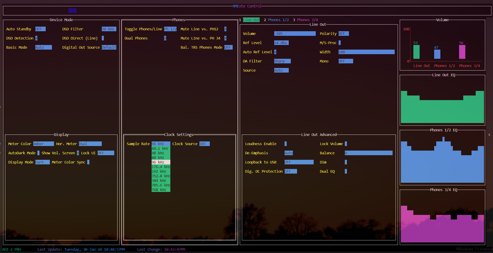

# RMEdiy
RMEote Control for RME ADI-2 Series DACs

Uses the MIDI protocol to control and communicate with the DACs. RME has provided excellent [docs](./static/MIDITable_ADI-2_230930.ods).

Mostly attempts to emulate the ADI-2 Remote app in terminal!   
__RMEdiator__ aka __RME midi mediator__ adds network control. This opens up capabilities for Home Assistant and other automations.

There's also a __Meter Color Sync__ option that syncs the meter color to the desktop background(Works with SignalRGB with a custom integration)   
It seems to handle high refresh rates quite well(video playback) 

Please note this is highly experimental. Lots of things could be made better but I wanted to get things working first.


## Usage
#### Run
[Download](https://github.com/n00bmax/RMEdiy/releases) the latest version for your arch  
or
```sh
go run .
```
from the repo directory
#### Build/Install
```sh
make build
```

```sh
make install
```

#### _This requires CGO_

Assumes the config file is in the current directory

## Config

Modify the _config.yaml_ file as necessary

```yaml
device:
  id: 0x72 # 0x71=ADI-2 DAC	    0x72=ADI-2 Pro	    0x73=ADI-2/4 Pro SE	
  midi_port_out: 1 #select the correct port
  midi_port_in: 0  #select the correct port
  server:
    port: 3333  #port for http access
    disable: false 
sync:
  interval: 10 #Seconds #status messages
  rgb:
    enabled: false #default false
    refreshRate: 500 #milliseconds
```
